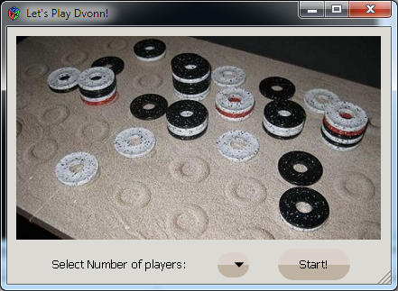

# DVONN

DVONN Game written in C and GTK+ (32 bit version)

The game description can be found [here](https://en.wikipedia.org/wiki/DVONN).

GTK can be found [here](http://www.gtk.org/download/index.php).

Developed in KeplerEclipse for CPP (windows). It can be found [here](http://eclipse.org).

Take a look at compiler-parameters.txt and add the options to eclipse.

If you don't care for the phases, the final phase is phase 2. Ignore Phase 1, comile and run phase 2 and enjoy :+1:
